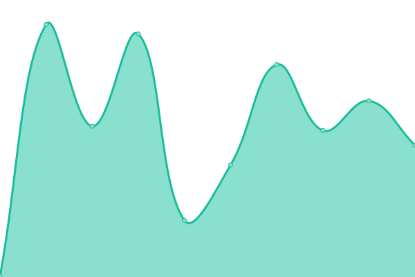
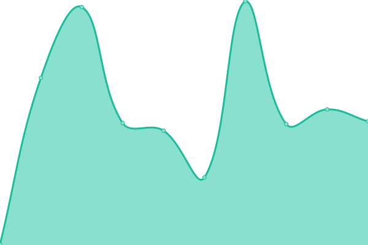

# [📈 Live Status](https://Leuthra.github.io/upptime): <!--live status--> **🟧 Partial outage**

This repository contains the open-source uptime monitor and status page for [Wu](romi.my.id), powered by [Upptime](https://github.com/upptime/upptime).

With [Upptime](https://upptime.js.org), you can get your own unlimited and free uptime monitor and status page, powered entirely by a GitHub repository. We use [Issues](https://github.com/Leuthra/upptime/issues) as incident reports, [Actions](https://github.com/Leuthra/upptime/actions) as uptime monitors, and [Pages](https://Leuthra.github.io/upptime) for the status page.

<!--start: status pages-->
<!-- This summary is generated by Upptime (https://github.com/upptime/upptime) -->
<!-- Do not edit this manually, your changes will be overwritten -->
<!-- prettier-ignore -->
| URL | Status | History | Response Time | Uptime |
| --- | ------ | ------- | ------------- | ------ |
|  [Portfolio Site](https://romi.my.id) | 🟥 Down | [portfolio-site.yml](https://github.com/Leuthra/upptime/commits/HEAD/history/portfolio-site.yml) | 

 314ms
     
 | 

<a href="https://Leuthra.github.io/upptime/history/portfolio-site">72.91%</a>
    

|  [API](https://hono.romi.my.id) | 🟩 Up | [api.yml](https://github.com/Leuthra/upptime/commits/HEAD/history/api.yml) | 

 1434ms
     
 | 

<a href="https://Leuthra.github.io/upptime/history/api">100.00%</a>
    

|  [CDN Uploader](https://cdn.romi.my.id) | 🟩 Up | [cdn-uploader.yml](https://github.com/Leuthra/upptime/commits/HEAD/history/cdn-uploader.yml) | 

 2605ms
     
 | 

<a href="https://Leuthra.github.io/upptime/history/cdn-uploader">100.00%</a>
    

|  [PKL Countdown](https://pkl.romi.my.id) | 🟩 Up | [pkl-countdown.yml](https://github.com/Leuthra/upptime/commits/HEAD/history/pkl-countdown.yml) | 

 1017ms
     
 | 

<a href="https://Leuthra.github.io/upptime/history/pkl-countdown">100.00%</a>
    

|  [AC Repair](https://acrepair.romi.my.id) | 🟩 Up | [ac-repair.yml](https://github.com/Leuthra/upptime/commits/HEAD/history/ac-repair.yml) | 

 250ms
     
 | 

<a href="https://Leuthra.github.io/upptime/history/ac-repair">100.00%</a>
    

|  [Docs Template](https://docs.romi.my.id) | 🟩 Up | [docs-template.yml](https://github.com/Leuthra/upptime/commits/HEAD/history/docs-template.yml) | 

 178ms
     
 | 

<a href="https://Leuthra.github.io/upptime/history/docs-template">100.00%</a>
    

|  [Portfolio Site](https://romidev.tech) | 🟥 Down | [portfolio-site.yml](https://github.com/Leuthra/upptime/commits/HEAD/history/portfolio-site.yml) | 

 314ms
     
 | 

<a href="https://Leuthra.github.io/upptime/history/portfolio-site">73.09%</a>
    

|  [Test Broken Site](https://thissitedoesnotexist.koj.co) | 🟥 Down | [test-broken-site.yml](https://github.com/Leuthra/upptime/commits/HEAD/history/test-broken-site.yml) | 

 0ms
     
 | 

<a href="https://Leuthra.github.io/upptime/history/test-broken-site">100.00%</a>
    

<!--end: status pages-->

[**Visit our status website →**](https://Leuthra.github.io/upptime)

## 📄 License

- Powered by: [Upptime](https://github.com/upptime/upptime)
- Code: [MIT](./LICENSE) © [Anand Chowdhary](https://anandchowdhary.com), supported by [Pabio](https://pabio.com)
- Data in the `./history` directory: [Open Database License](https://opendatacommons.org/licenses/odbl/1-0/)
