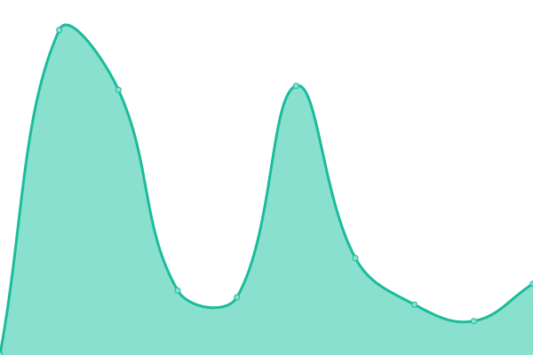
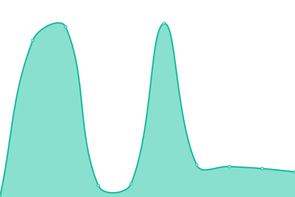
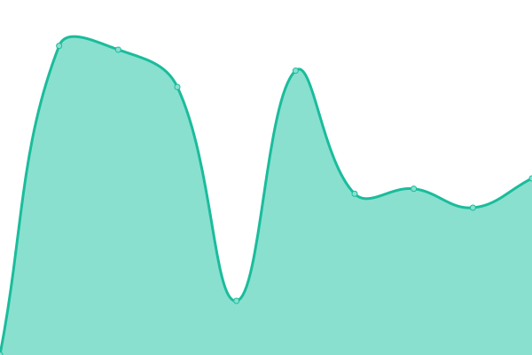

# [📈 Live Status](https://Leuthra.github.io/upptime): <!--live status--> **🟧 Partial outage**

This repository contains the open-source uptime monitor and status page for [Wu](romi.my.id), powered by [Upptime](https://github.com/upptime/upptime).

With [Upptime](https://upptime.js.org), you can get your own unlimited and free uptime monitor and status page, powered entirely by a GitHub repository. We use [Issues](https://github.com/Leuthra/upptime/issues) as incident reports, [Actions](https://github.com/Leuthra/upptime/actions) as uptime monitors, and [Pages](https://Leuthra.github.io/upptime) for the status page.

<!--start: status pages-->
<!-- This summary is generated by Upptime (https://github.com/upptime/upptime) -->
<!-- Do not edit this manually, your changes will be overwritten -->
<!-- prettier-ignore -->
| URL | Status | History | Response Time | Uptime |
| --- | ------ | ------- | ------------- | ------ |
|  [Portfolio Site](https://romi.my.id) | 🟩 Up | [portfolio-site.yml](https://github.com/Leuthra/upptime/commits/HEAD/history/portfolio-site.yml) | 

 209ms
     
 | 

<a href="https://Leuthra.github.io/upptime/history/portfolio-site">100.00%</a>
    

|  [API](https://hono.romi.my.id) | 🟩 Up | [api.yml](https://github.com/Leuthra/upptime/commits/HEAD/history/api.yml) | 

 1000ms
     
 | 

<a href="https://Leuthra.github.io/upptime/history/api">100.00%</a>
    

|  [CDN Uploader](https://cdn.romi.my.id) | 🟩 Up | [cdn-uploader.yml](https://github.com/Leuthra/upptime/commits/HEAD/history/cdn-uploader.yml) | 

 2447ms
     
 | 

<a href="https://Leuthra.github.io/upptime/history/cdn-uploader">100.00%</a>
    

|  [PKL Countdown](https://pkl.romi.my.id) | 🟩 Up | [pkl-countdown.yml](https://github.com/Leuthra/upptime/commits/HEAD/history/pkl-countdown.yml) | 

 913ms
     
 | 

<a href="https://Leuthra.github.io/upptime/history/pkl-countdown">100.00%</a>
    

|  [AC Repair](https://acrepair.romi.my.id) | 🟩 Up | [ac-repair.yml](https://github.com/Leuthra/upptime/commits/HEAD/history/ac-repair.yml) | 

 207ms
     
 | 

<a href="https://Leuthra.github.io/upptime/history/ac-repair">100.00%</a>
    

|  [Docs Template](https://docs.romi.my.id) | 🟩 Up | [docs-template.yml](https://github.com/Leuthra/upptime/commits/HEAD/history/docs-template.yml) | 

 114ms
     
 | 

<a href="https://Leuthra.github.io/upptime/history/docs-template">100.00%</a>
    

|  [Ballooney](https://ballooney.co.id) | 🟩 Up | [ballooney.yml](https://github.com/Leuthra/upptime/commits/HEAD/history/ballooney.yml) | 

 486ms
     
 | 

<a href="https://Leuthra.github.io/upptime/history/ballooney">100.00%</a>
    

|  [Blue Power Technology](https://www.bluepowertechnology.com) | 🟩 Up | [blue-power-technology.yml](https://github.com/Leuthra/upptime/commits/HEAD/history/blue-power-technology.yml) | 

 1712ms
     
 | 

<a href="https://Leuthra.github.io/upptime/history/blue-power-technology">100.00%</a>
    

|  [Hamparan Stone](https://hamparanstone.com) | 🟩 Up | [hamparan-stone.yml](https://github.com/Leuthra/upptime/commits/HEAD/history/hamparan-stone.yml) | 

 1306ms
     
 | 

<a href="https://Leuthra.github.io/upptime/history/hamparan-stone">100.00%</a>
    

|  [Inkprint](https://inkprint.id) | 🟩 Up | [inkprint.yml](https://github.com/Leuthra/upptime/commits/HEAD/history/inkprint.yml) | 

 5311ms
     
 | 

<a href="https://Leuthra.github.io/upptime/history/inkprint">99.23%</a>
    

|  [Decor House Indonesia](https://decorhouseindonesia.com) | 🟩 Up | [decor-house-indonesia.yml](https://github.com/Leuthra/upptime/commits/HEAD/history/decor-house-indonesia.yml) | 

 1373ms
     
 | 

<a href="https://Leuthra.github.io/upptime/history/decor-house-indonesia">100.00%</a>
    

|  [Jaroemsadha](https://jaroemsadha.com) | 🟩 Up | [jaroemsadha.yml](https://github.com/Leuthra/upptime/commits/HEAD/history/jaroemsadha.yml) | 

 2902ms
     
 | 

<a href="https://Leuthra.github.io/upptime/history/jaroemsadha">100.00%</a>
    

|  [Kontakami](https://kontakami.com) | 🟩 Up | [kontakami.yml](https://github.com/Leuthra/upptime/commits/HEAD/history/kontakami.yml) | 

 1409ms
     
 | 

<a href="https://Leuthra.github.io/upptime/history/kontakami">100.00%</a>
    

|  [Monelo](https://monelo.id) | 🟥 Down | [monelo.yml](https://github.com/Leuthra/upptime/commits/HEAD/history/monelo.yml) | 

 8003ms
     
 | 

<a href="https://Leuthra.github.io/upptime/history/monelo">98.56%</a>
    

|  [Sugar Filtration Screens](https://sugarfiltrationscreens.com) | 🟩 Up | [sugar-filtration-screens.yml](https://github.com/Leuthra/upptime/commits/HEAD/history/sugar-filtration-screens.yml) | 

 1387ms
     
 | 

<a href="https://Leuthra.github.io/upptime/history/sugar-filtration-screens">100.00%</a>
    

|  [Trovee Studio](https://troveestudio.com) | 🟩 Up | [trovee-studio.yml](https://github.com/Leuthra/upptime/commits/HEAD/history/trovee-studio.yml) | 

 1903ms
     
 | 

<a href="https://Leuthra.github.io/upptime/history/trovee-studio">100.00%</a>
    

|  [Portfolio Site 1](https://romidev.tech) | 🟩 Up | [portfolio-site-1.yml](https://github.com/Leuthra/upptime/commits/HEAD/history/portfolio-site-1.yml) | 

 3380ms
     
 | 

<a href="https://Leuthra.github.io/upptime/history/portfolio-site-1">100.00%</a>
    

|  [Test Broken Site](https://thissitedoesnotexist.koj.co) | 🟥 Down | [test-broken-site.yml](https://github.com/Leuthra/upptime/commits/HEAD/history/test-broken-site.yml) | 

 0ms
     
 | 

<a href="https://Leuthra.github.io/upptime/history/test-broken-site">100.00%</a>
    

<!--end: status pages-->

[**Visit our status website →**](https://Leuthra.github.io/upptime)

## 📄 License

- Powered by: [Upptime](https://github.com/upptime/upptime)
- Code: [MIT](./LICENSE) © [Anand Chowdhary](https://anandchowdhary.com), supported by [Pabio](https://pabio.com)
- Data in the `./history` directory: [Open Database License](https://opendatacommons.org/licenses/odbl/1-0/)
